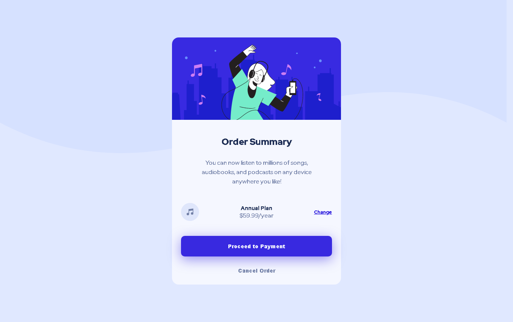

# Frontend Mentor - Order summary card

## Welcome! 👋

This is a solution to the [Order summary card](https://www.frontendmentor.io/challenges/order-summary-component-QlPmajDUj/hub/order-summary-component-RigQ6BHql). Frontend Mentor challenges help you improve your coding skills by building realistic projects.

## Table of contents

- [Overview](#overview)
  - [The challenge](#the-challenge)
  - [Screenshot](#screenshot)
  - [Links](#links)
- [My process](#my-process)
  - [Built with](#built-with)
- [Author](#author)

## Overview

### The challenge

Users should be able to:

- View the optimal layout for the site depending on their device's screen size
- See hover states for all interactive elements on the page

### Screenshot

### Links

- Solution URL: [Add solution URL here](https://github.com/rearalf/order-summary-component)
- Live Site URL: [Add live site URL here](hhttps://order-summary-component-red-one.vercel.app/)

## My process

### Built with

- Semantic HTML5 markup
- CSS custom properties
- Flexbox
- CSS Grid
- Mobile-first workflow
- Sass

## Author

- Website - [Ricardo Alf](https://rearalf.vercel.app/)
- GitHub - [rearalf](https://github.com/rearalf)
- Frontend Mentor - [@rearalf](https://www.frontendmentor.io/profile/rearalf)
- Twitter - [@rear_alf](https://twitter.com/rear_alf)